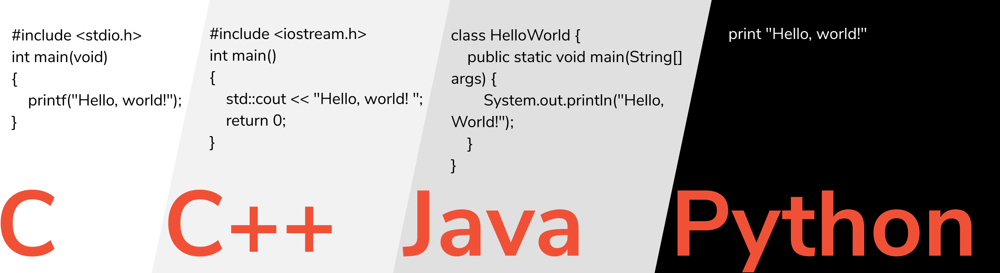

# Getting Started with Python in VS Code

This tutorial is based on the [Getting Started with Python in VS Code document](https://code.visualstudio.com/docs/python/python-tutorial). It is revised to fit beginners.

## Hello World

It is a tradition from C programming language to say "Hello World" as the first program in learning a new programming langauge. Below is a comparison of the first program in different langauges.



In Python, it is a single line: `print('Hello World!')`.

## Excute Python Code

It is usually a good idea to create a folder that works as your workspace for an application. An application usually consists of many files and data resources. You can create a folder using GUI or CLI. As a programmer, you often use CLI.

Open your terminal (MacOS) or command line (Windows). Create a new folder named as "hello-world" and change director to the folder. The two commands are:

```sh
mkdir hello-world
cd hello-world
```

Then use `code .` command to run VS Code that uses the current folder `.` as the workspace. The `.` means the current folder, which is `hello-world` now. In Mac computer, you can use `pwd` command to check that you are in the correct folder. In Windows CMD, use `cd` to check the current folder.

With Python interpreter installed, you can run the code in Python interpreter (`python3`) or in IDLE (`idle`). Once you install Python3 and VS Code, you have several ways to run Python code. Together, you can

1. run `python3` or `idle3` in your computer OS terminal or in the VS Code terminal.
1. when you create `.py` file such as `hello.py`, you can run the file from a terminal using `python3 hello.py`.
1. in VS Code, run Jupyter Notebook cells for files that has `.ipynb` appendix. Check the doc [Jupyter Notebooks in VS Code](https://code.visualstudio.com/docs/datascience/jupyter-notebooks).
1. in VS Code, run code cells marked by `# %%` in a `.py` files -- this is better than `idle3` or `python3`. Check the doc [Python Interactive Window](https://code.visualstudio.com/docs/python/jupyter-support-py)
1. write/wring Python code in an interactive Python window in VS Code. Usually this window opens when you run Jupyter notebook cells or Python cells. This is used for one line code because the limited editing space.
1. in VS Code, use menu or shortcut to run/debug a Python files that has `.py` appendix.

Because VS code has good support of Python development, we only use the first method to run very simple Python code and use VS code as much as possible. To many developers, VS Code is the **best IDE** to write, run and debug Python code.

## Use Packages

The Python interpreter comes with functions such as `print` and arithmatic operations. Most functions are developed by different companies and are shared/reused in a specific package format and are often called packages or libraries. To use these extra functions, you need to install the package and import them into your Python program.

Create a `plot.py` file in the current workspace with the following content:

```python
import matplotlib.pyplot as plt
import numpy as np

x = np.linspace(0, 20, 100)  # Create a list of evenly-spaced numbers over the range
plt.plot(x, np.sin(x))       # Plot the sine of each x point
plt.show()                   # Display the plot
```

You don't need to understand the code here. Just know that it uses fucntions not built into the Python interpreter.

You will see underlines in `matplotlib` and `numpy` if you don't have the required packages installed. If you run the file regardlessly, you will see an error message: `ModuleNotFoundError: No module named 'matplotlib'`.

To fix the error, you need to install `matplotlib` package. The `matplotlib` package uses functions from `numpy` package. When you install `matplotlib`, it installs `numpy` package as a dependency.

In a terminal, run `pip install matplotlib`. Then you should be able to run the file inside VS Code, or from a terminal using command `python3 plot.py`.
