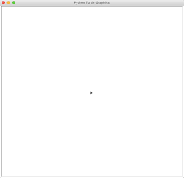

# Turtle Graphics

Python has a built-in `turtle` module for a long history. It is fun to code with because the its operation effects are visible and could be amazing. Here you use it to execute sequential operations and use constant defintions.

## 1 Two Programming Patterns

As using other modules, you need to import a module to use it. Once you import the `turtle` module, you can use it in two programming patterns:

- Procedure-oriented: all functions/operations are directly available in `turtle` module, you call the function as `turtle.operation(...)`. For example, `turtle.showturtle()` or `turtle.forward(100)`. Here the `turtle` is a module and the name after `.` is a function name.
- Object-oriented: the `turtle` module actually has many objects. Like the real world, there are many objects interact/collaborate with each other to perform functions.
  - An **object** has both data and methods. You use an object's methods to run operations, usually manipulate its data or perform some I/O operations.
  - Unlike the procedure-oriented way, you should create an object from its class to use it.
  - A **class** defines a template for objects that share the same properties (data) and operations. For example, a `Student` class can have `student_id` and `major` properties and can have same set of operations such as `do_homework` and `take_test`. An object, also called an **instance** may have different instance data for `student_id` and `major`.
  - Use the dot notation `student.do_homework` to call an instance method. Here the `student` is an instance/object of the `Student` class and `do_homework` is its method.

You can use either procedure-oriented or object-oriented in Python interactive intepreter or IDLE3. However, when writing code in VS Code, it is better to use object-oriented pattern because VS Code can show better help information for objects and methods.

## 2 The `Turtle` Class

The `turtle` module defines a `Turtle` class that has a canvas that you can draw pictures on it. It draws pictures as a turtle walking on earth. It has many methods that simulate operations a turtle can do such as go foward, turn right and etc.

Because the `Turtle` class draws on a canvas, it also works like a pen. Actually the `Turtle` class has an aliase named `Pen`. It has operations such as open down, penup, fillcolor.

## 3 The `pen` Instance

### 3.1 Create an Instance

You call the `turtle.Turtle()` or `turtle.Pen()` to create an instance of `Turtle` class (also called `Pen`, they are the same class).

```py
import turtle
pen = turtle.Pen()

# To make the graphics stay in a non-ineractive execution
turtle.done()
```

The first two lines are enough if you execute the code inside Python interprete or `idle3`. It is called an interactive execution. If you write the code in a `.py` file and run it from VS Code or from a command line, the canvas shows and disappears because the code completes. To make the canvas stay, call `turtle.done()`. `done` is a function defined in the `turtle` module.

### 3.2 The Canvas

The instance creates a canvas that has defulat properties such as width (`400px`), height(`300px`) and backgroundcolor (`'white'`). To distinguish the instance from the `turtle` module, we use a variable name `pen` for the instance of the `Turtle`/`Pen` class. When the `pen` instance is created, an arrowhead symbol in black color is drawn in the canvas like the following:



You can think the arrowhead as a mix of a turtle and a pen: it can move and draw at the same time.

### 3.3 The Coordinate

As in a math class, the canvas is modeled after a **Cartesian coordinate system** where a unit is a pixel in the canvas. The coordinates are not shown in the canvas but you can think it as the following:


## 4 Move and Draw

Create a file `turtle-demo.py` in an empty folder (a good habit for a new project), open VS Code in the folder. You can type the following code and watch the drawing process to see the operations in action.

```python
import turtle

pen = turtle.Pen()

# a slow motion at speed 1. Speed 10 is the fastest
pen.speed(1)

pen.forward(50)
pen.right(90)
pen.forward(50)
pen.left(90)
pen.backward(100)
pen.sety(50)
pen.forward(100)


pen.goto(0, 0)

# To make the graphics stay in a non-ineractive execution
turtle.done()
```
