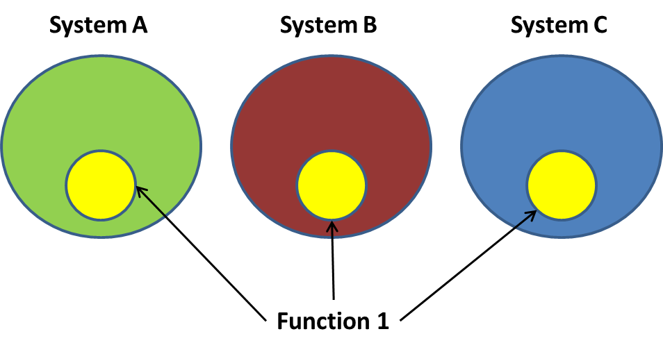

# Function Concepts

This section first explains what is a function and the two reasons you want to use functions: code structure and code reuse. Then it describes how to define and call functions.

## 1 What and Why

A function is a group of statements that performs a specific task. Though there is no limit in the number of statements that you can write inside a function, it is important that a function consists of a group of closely related statements to serve a single purpose. It will make your code easy to read and maintain.

Why you need functions? A simple anwser is divide and conquer. Programmers use functions to organize and reuse code. Instead of writing a long list of statements of a complex application, you can divide the application into a set of subtasks such that each task is relatively easy to be solved.


In the above diagram, instead of a long list of statements on the left, you can organize statements into a set of functions that each function perform a single subtask. It helps you to design the program because at one moment you only need to solve a relatively simpler subtask.

For example, following is a list of operations that a robot performs:

1. unplug from charger
2. walk to the house door
3. open the house door
4. walk out the house door
5. close the house door
6. walk to the car
7. open the car door
8. sit in the car
9. close the car door
10. drive the car to Beach Dr

If you use two functions, the code will be

1. leave home (this function has the statements 1 to 5)
2. drive to shcool (this function has the statements 6 to 10)

The functional version is easy to write and easy to understand. Another huge benefit is that a function name summarizes the task. It is easy to understand the two function calls if you don't care about the implementation details. You can image the pain when you have to figure out the purpose of 1,000 lines of code.

If a subtask is too complex, you can divided it into a set of subtasks agian. A function represents a subtask can be be divided into more functions. Eventually you may have a program structured as the following:


The structure is a payroll application. You can see the five subtasks at the first level. The first function and the third function uses two other functions to perform their tasks. If you replace all functions with their statements, it will be a big mess and it is hard to figure out the purpose of a list of detail operations.

Therefore divide and conquer using functions let you deal with easy-to-solve subtasks. It also makes the program structure easy to understand.

Another benefit of function is code reuse. By putting a group of statements into a function, you can reuse the function with a simple function call in multiple places. Following is an exmple that three systems share a function.



An important principle in programming is Don't Repeat Yourself (DRY). Function reuse not only reduces the number of statements, it also make it easy to change the code in one place. If there is a bug in a funciton, you only need to fix the function defintion in one place and all function calls use the revised version.

There are many other benefits in testing, collaboration etc. The two most important benefits are structured code (divide and conque) and code reuse.

## 2 Defining a Function

The syntax to define a function is rather simple in Python. Following are examples of three function defintions:

```python
# define a function: no parameter, no retrun value
def function_name1():
    """Document for this function."""
    statement
    statement
    ...


# define a function: two parameters, no retrun statement
# returns None as default value
def function_name2(parameter1, parameter2):
    """Document for this function."""
    statement
    statement
    ...

# define a function: two parameters, has a retrun value
def function_name3(parameter1, parameter2):
    """
    Summary for this function followed by a blank line.

    Detail description about the input, process and output
    ofof the function.
    """
    statement
    statement
    ...
    return something
```

### 2.1 Function Header

The first line is the `function header`. It begins with the keyword `def`, followed by a function name, an optional list of parameters enclosed in parenthese, and ends with a colon.

Python has the same set rules and styles for the function name. They are:

- You cannot use keyword as a function name
- A function name must start with an underscore or a letter in the ranges of `'a'` to `'z'` or `'A'` to `'Z'`.
- After the first character, you may use an underscore, any letter in the ranges of `'a'` to `'z'` or `'A'` to `'Z'`, any digit 0 to 9.
- A function name is case sensitive and cannot contain spaces.
- Python suggests snake_casing as function name: lower case words separated by an underscore.
- It is a best practice to use a verb or a verb pluses a none for a function name. For example, `prepare`, `do_homework`, `print_message`.

When you write more code, the naming rules and styles will become a second nature to you.

### 2.2 Function Parameters and Default Argument

A function header may have zero, one, or more `parameters` enclosed in parenthese. If there is no parameter, the function header just has a pair of parenthese. If there are two or more parameters, they are separated by a comma `,`. In the above functin headers, they are:

- `function_name1()`
- `function_name2(parameter1, parameter2)`
- `function_name3(parameter1, parameter2)`

You can have as many parameters as you want, but it is not a good idea to have more than five paramters. You way want to split your function into small functions or compose parameters when there are too many parameters.

As the naming of variables and functions, you should give meaningful names to the function parameters because they are used as variables in the function code.

When you call a function, you pass values to the parameters. These values are called `arguments`. Python supports `default argument`. You can define a default value for a parameter as the following:

```python
def greet(name, prefix = 'Hello')
    print(prefix, name)
```

When you call `greet` without giving an argument for `prefix`, it uses the `'Hello'` as the arugment value.

### 2.3 Docstring for Functions

Except for trivial functions, you should write a **docstring** for the function. It can be a single line docstring, as shown in the first examples, or it can be a multi-line docstring: a summary line, followed by a blank line and detail description.

### 2.4 Function Body

The function body is the code block indented (4 spaces, per Python coding style) below the function header. The statements in the function body are just regular statements. You can use all control statements (`if`, `for`, and `while`) in the fucntion body.

An non-indented statement below the function header marks the end of the function body. For example:

```python
def greet(name, prefix = 'Hello')
    print(prefix, name)
print('Done')
```

In the above code, the statement `print('Done')` is not part of the function. You should use a blank line separate a function and the statements before and after it.

```python
def greet(name, prefix = 'Hello')
    print(prefix, name)

print('Done')
```

### 2.5 The `pass` Keyword

When you design a porgram, you divide your application into several functions but don't know the implementation details for some of you functions. You can use the `pass` keyword as a temporary function body. You replace it with real code when you are ready to implement it.

```python
def do_homework():
    pass
```

### 2.6 Returning Value

Some functions perform operations without returning a value, they are called `void functions`. The `void` means **nothing**. The above function that prints a message is a void function. The function `exit()` takes no argument and is a void function. It exits the program execution.

Many functions perform some computation and return a value as its result. These are `value-returning` functions. You use the `return expression` in a function to return a value and complete the function. For example:

```python
def add(number1, number2):
    return number1 + number2
```

A function body may have multiple `return` statements. For example:

```python
def isOdd(number):
    if number % 2 == 1:
        return True
    else:
        return False

    # unreachable statement
    print('unreachable')


print(isOdd(5))
print(isOdd(8))
```

Whenever Python executes a `return` statement, it **completes** the current function and returns its expression value. In the above code, the `print('unreachable')` is unreachable because both branches of the `if` statement has a `return` statement.

Actually, the above code is not a good example because `number % 2 == 1` is a boolean expression and can be returned directly. The above code can be simplified as:

```python
def isOdd(number):
    return number % 2 == 1

print(isOdd(5))
print(isOdd(8))
```

### 2.7 Retruning Multiple Values

It is possible to return multiple values using the `return` statement. You list the variables to be returned after the `reture` keyword and use `,` to separate the multiple values. The following is an example:

```python
def get_name():
    first = input('First name? ')
    second = input('Second name? ')
    return first, second

first_name, second_name = get_name()

print(first_name, second_name)
```

As you can see, you use multiple variables, seprated by `,` to retrieve the multiple returning values.

The statement `return first, second` actaully returns a data type of `tuple`. Python uses the syntax `(e1, e2, e3,...)` to represent a tuple that have multiple elements. The `return first, second` can be written as `return (first, seond)`. We will cover tuple in later sections.

## 3 Calling Function

To use a function is to `call` a function. To call a parameterless function, use the syntax `function_name()`. For example:

```python
def sayHi():
    print('Hello')

# call the function
sayHi()
```

To call a function that has parameters, you need to pass an argument for each parameter in the parenthese, in the same order as they are defiend. These arguments are called `positional arguments`. For example:

```python
def greet(first_name, last_name):
    print(f'Hi {first_name} {last_name}')

greet('Alicia', 'Keys')
```

You can use the parameter name to pass an argument to the function call. This is a so-called `keyword argument`. You don't need to follow the order as defined in the function header. For example, you can call the above functions as one of the following:

- `greet(first_name='Alicia', last_name='Keys')`
- `greet(last_name='Keys', first_name='Alicia')`

The keyward argument is helpful when there are several parameters and you want make them more readable.

When a function has a default argument, you can use the default argument or pass a new value. For example:

```python
def greet(first_name, last_name, prefix='Hello'):
    print(f'{prefix} {first_name} {last_name}')

greet('Alicia', 'Keys')
greet('Bob', 'Dylan', 'Hi')
```

The default arguments must be at the end of the parameter list.

If you use a keyword argument, it must be after positional arguments.

```python
def greet(first_name, last_name, prefix='Hello'):
    print(f'{prefix} {first_name} {last_name}')

greet(prefix='Hi', first_name='Elton', last_name='John')
greet('Alicia', prefix='Hi', last_name='Keys')
```

Positional arguments cannot follow keyward arguments, they must be passed before keyward arguments. A function call `greet('Alicia', prefix='Hi', 'Keys')` causes a an error: `SyntaxError: positional argument follows keyword argument`.
