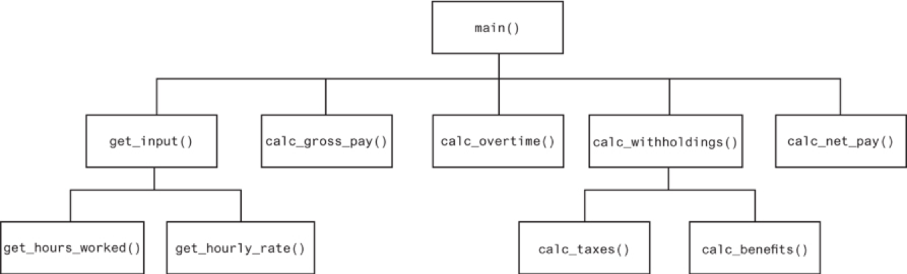
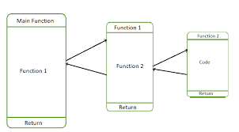

# `main` and Variable Scope

This section introduces the `main` function and variable scopes.

## 1 `main` Function

There is a convention in Python coding: you want to use the `main` function name as the entry point of a program. A non-trivial program has many functions, however, there must be a function working as the entry point of the program. It is common to use `main` as the name of the start-up function. The `main` contains the mainline logic of a programthat calls other functions to perform top level tasks. Each top level task may call other functions to perform subtasks. Following is an example of function organization.



You should use `main` as the entry of your program as the following:

```python
def main():
    number = 42
    print_triple(number)

def print_triple(number):
    triple = number * 3
    print(f'Triple of {number} is {triple}.')

main()
```

As shown above, you can use a funtion and define it later.

## 2 Variable Scope

Every Python varaible has a scope -- it is only visible in the region it is defined.

### 2.1 Local Variable

A variable defined inside a function can be used in the function after it is defined. This is called a `local variable`. The function is the scope of the local variable. Outside the function, it is invisible and cannot be used.

```python
def main():
    number = 42    # a local variable
    print(number)  # use the local variable

main()
```

The function parameters are also local variables. You can use them inside the function as locally defined variables. Assigning a parameter to another value doesn't affect the corresponding argument.

```python
def main():
    number = 42
    print_triple(number)
    print(f'The number in main is {number}')

def print_triple(number):
    number *= 3
    # you shouldn't change the parameter to avoid subtle bugs
    # you should use a new variable: triple = number * 3
    print(f'Tripled number is {number}')

main()
```

In the above code, the `number` in `main` is a local number and is passed to `print_triple` function. Inside the `print_triple` function, the `number` is a local variable -- a totally different one from the `number` in `main`. The program assigns it to a different value of `126`. In the `main` function, it still has a value of `42`.

### 2.3 Global Variable

A variable defined in the main body of a file, i.e, not defined in a function, is called a `global variable`. It is visible and accessible to all statements inside or outside the functtions.

Because a global variable is shared by all functions, you should not define and use global variables in your program because it is hard to tell where it is changed. The only resonable situation for global variable is to define constant values that is shared by all function. For example, define the math constant `PI` as the following.

```python
PI = 3.1416

def main():
    radius = 42
    print_area(radius)

def print_area(radius):
    area = radius * radius * PI
    print(f'The area is {area: .2f}')

main()
```

## 2.4 Control Statements

The scope for variables defined in control statements `if`, `for` and `while` is its enclosing function. If they are not defined in a function (very rare), they are in the global scope. Below is an example:

```python
def main():
    for number in range(3):
        print(number)

    print(number)

main()
```

The `number` is created in the `for` loop but its scope is the `main` function. Therefore it can be used by the `print(number)` statement in the `main` function.

## 3 Call Stack

Usually your program has a entry point function and the function calls other functions which call more other functions. When a function calls another function, Python intepreter saves the status of the current function in a data structure called a `call frame`, then executed the callee function. Similarly, the callee function may call another funciton and more and more, eventually, we have a so-called call stack.



For example, you can debug the following program to check its call stack and call frames.

```python
def foo():
  x = "foo"
  print(f"foo line 2. x is {x}")
  print("foo line 3")
  print("foo line 4")

def fum():
  print("fum line 1")
  print("fum line 2")
  print("fum line 3")

def bar():
  x = 21
  print(f"bar line 2. x is {x}")
  fum()
  foo()
  print(f"bar line 5. x is {x}")

def main():
  x = 42
  bar()
  print(f"main line 3. x is {x}")

main()
```

The `main` function calls the `bar` function that calls three more functions: `print`, `fum`, `foo`. The `print` function is called twice. When the `bar` calls `foo`, there are three functions in the statck: at the bottom, `main`, then `bar`, then, at the top, `foo`. You can debug the code to see the call stack. When a function returns, its call frame is poped up from the stack and its caller becomes the top function in the call stack. The variable `x` is a local variable in its function scope and may have different values at different time.
