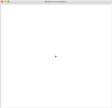
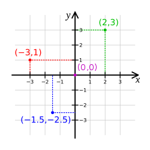

# Turtle Graphics

A typical python program has many functions therefore Python organizes a set of functions into a module. Unlike other modeuls such as `numpy`, you don't need to install the `turtle` module because it is a built-in module [`turtle`](https://docs.python.org/3/library/turtle.html) for a long history. It is fun to code with because its operation effects are visible and could produce interesting graphics. Here you use it to learn

- write sequential operations.
- define variables.
- use constant defintions.

## 1 Two Programming Patterns

Unlike using built-in functions, you need to import a module to use it. Once you import the `turtle` module, you can use it in one of two programming patterns:

- Functional Prorgramming (`FP`): all functions/operations are directly available in `turtle` module, you call the function as `turtle.function_name(...)`. For example, `turtle.showturtle()` or `turtle.forward(100)`. Here the `turtle` is a module and the name after `.` is a function name.
- Object-oriented (`OO`): the `turtle` module has many classes. A class is a blueprint to create objects. Like the real world, there are many objects interact/collaborate with each other to perform functions.
  - An **object** has both data and methods. You use an object's methods to run operations, usually manipulate its data or perform some I/O operations.
  - Unlike the procedure-oriented way, you need to create an object from its class before you can use it.
  - A **class** defines a blueprint for objects that share the same properties (data) and operations. For example, a `Student` class can have `student_id` and `major` properties and can have same set of operations such as `do_homework` and `take_test`. Different objects, also called an **instance** may have different properties values for `student_id` and `major`.
  - Use the dot notation `alice.do_homework()` to call an instance method. Here the `alice` is an instance/object of the `Student` class and `do_homework` is its method. Similarly, dot notation `alice.student_id` and `alice.major` are used to read/write the `alice`'s properties.

You can use either FP or OO styles. Object-oriented was popular but today's developers prefer FP style for reasons beyond this course. Here we use the FP style.

## 2 The `turtle` module

The `turtle` module defines many functions around three entities: a turtle, a pen, and a screen. A turtle uses a pen to draw pictures in a screen. The turtle can have different shapes and its primary functions are drawing with a pen when it moves. A pen can be `up` (not drawing) or `down` (drawing) and can have different sizes and colors. A screen also has different colors and sizes in which the turtle draws pictures.

As learning any Pyhthon modules, you can only learn by doing.

## 3 The code template

To avoid the confusing with `turtle` module name, don't use `turtle.py` as your program file name. Youc can use a different name such aqs `turtle_demo.py`.

### 3.1 Keep the screen open

You can write tutrle code interactively inside `idle3` or `python3` interpreter. However, when you run a tutle program (for example in a file name `turtle_demo.py`) using command line `python3 turtle_demo.py`, the screen disappears when the program completes. To keep the screen open, you should call a special function: `turtle.done()` as the last statement. Therefore, the code template is as the following:

```py
import turtle

# all the operations are here

# To make the graphics stay in a non-ineractive execution
turtle.done()
```

### 3.2 The screen

The turtle module uses a screen that has defulat properties such as width (`400px`), height(`300px`) and backgroundcolor (`'white'`). By default, a turtle is a blakc arrowhead symbol drawn in a screen like the following:



You can think the arrowhead as a mix of a turtle and a pen: it can move and draw at the same time.

### 3.3 The Coordinate

As in a math class, the canvas is modeled after a **Cartesian coordinate system** where a unit is a pixel in the canvas. The coordinates are not shown in the canvas but you can think it as the following:



## 4 Move

Create a file `turtle_demo.py` in an empty folder (a good habit for a new project), open VS Code in the folder. You can type the following code and watch the drawing process to see the operations in action. You may want to add one move at a time.

```python
import turtle

# a slow motion at speed 1. Speed 10 is the fastest
turtle.speed(1)

turtle.forward(50)
turtle.right(90)
turtle.forward(50)
turtle.left(90)
turtle.backward(100)
turtle.sety(50)
turtle.forward(150)

# For heading: 0 - east, 90 - north, 180 - west, 270 - south
turtle.setheading(220)
turtle.forward(100)

turtle.goto(30, 30)
turtle.home()

# To make the graphics stay in a non-ineractive execution
turtle.done()
```

## 5 Draw

- `turtle.circle(50)`: draw a circle with a `50px` radius
- `turtle.dot(20, 'blue')`: draw a blue dot with size of `20px`.
- `turtle.shape('blank')`: don't show arrowhead.
- `turtle.up()`: not drawing when moving
- `turtle.down()`: drawing when moving
- `turtle.width(10)`: set width to 10px
- `turtle.color('brown')`: set pen color
- `turtle.write('hi', font=("Arial", 18, "normal"))`: write the text using the specified `font`. `write` takes multiple parameters, use parameter name `font` to specify provided argument.

Demo code:

```python
import turtle

# a slow motion at speed 1. Speed 10 is the fastest
turtle.speed(1)
turtle.dot(20, 'blue')
turtle.circle(50)
turtle.width(10)
turtle.forward(50)
turtle.color('brown')
turtle.up()
turtle.forward(30)
turtle.down()
turtle.write('hi', font=('Arial', 18, 'normal'))
turtle.shape('blank')

# To make the graphics stay in a non-ineractive execution
turtle.done()
```

## 6 Getting Input

The `turtle` module provide two input functions:

- `turtle.textinput(title, prompt)`: pop up an input box for a string.
- `turtle.numinput(title, prompt, default=None, minval=None, maxval=None)`: pop up an input box for a number. You can provide optinoal default value, minimum and maximum value. It asks you to input again if the number is out of range.

```python
import turtle

DEFAULT_NUMBER = 1000
MIN_NUMBER = 10
MAX_NUMBER = 10_000

turtle.bgcolor('blue')

num = turtle.numinput("Poker", "Your stakes:", DEFAULT_NUMBER, minval=MIN_NUMBER, maxval=MAX_NUMBER)

turtle.color('orange')
turtle.write(num, font=('Arial', 28, 'normal'))

turtle.done()
```

It is a best practice to define constant values using meaningful variables names that use uppercase words seperated by underscore.

## Query Turtle's State

You can query the current states of a pen using methods such as `position`, `xcor`, `ycor`, `heading` and etc. The following is a demo file `turtle_demo.py`:

```python
import turtle

TEXT_FONT = ('Arial', 18, 'normal')

turtle.forward(100)
turtle.left(90)
turtle.forward(100)

postion = turtle.position()
turtle.write(postion, font = TEXT_FONT)

turtle.goto(150, 150)
x_coordinate = turtle.xcor()
y_coordinate = turtle.ycor()
coordinate = f'x: {x_coordinate}, y: {y_coordinate}'
turtle.write(coordinate, font = TEXT_FONT)

turtle.setheading(180)
turtle.forward(200)
turtle.write(turtle.heading(), font=TEXT_FONT)

# To make the graphics stay in a non-ineractive execution
turtle.done()
```

## 8 Resources

All the module, classes and operations used above are documente in [`turtle` - Turtle Grpahics](https://docs.python.org/3/library/turtle.html).

[The beginner's guide to Python turtle](https://realpython.com/beginners-guide-python-turtle/) is a good introduction.

As always, there is no perfect document/help, just try.
